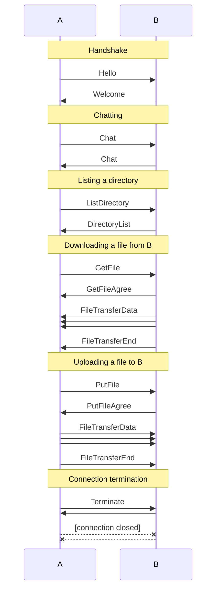

# wftp

<p align="center">
  A worse file transfer protocol.
</p>
<p align="center">
  <a href="https://asciinema.org/a/Gg3APBxWryAO0DCaWWTQzmoc4" target="_blank"></a>
</p>

<!--
  Heads up! The screen recording is stored in the above asciinema link:
  https://asciinema.org/a/Gg3APBxWryAO0DCaWWTQzmoc4
  -->

- Author: Diamond Dinh <diamondburned@csu.fullerton.edu>
- Repository: [libdb.so/wftp](https://libdb.so/wftp)
- Documentation: [package libdb.so/wftp](https://godocs.io/libdb.so/wftp)

## Build

Requirements:

- [Go](https://golang.org/) 1.21 or later.

To build the project, run:

```sh
go build ./cmd/wftp
```

Then invoke the binary as `./wftp`. Alternatively, you may install it by first
setting up your `GOPATH` and `GOBIN` environment variables, then running:

```sh
go install ./cmd/wftp
```

Then invoke the binary as `wftp`.

## Usage

wftp assumes one peer is trying to talk to another peer. At least one of the
peers must be listening for a connection. The other peer must connect to the
listening peer.

To listen for a connection, run:

```sh
wftp -l :8080 # no authentication
wftp -l :8080 -s supersecret # with authentication
```

> [!NOTE]
> You may use `-l :0` to listen on a random port. The program will print the
> port it's listening on.

> [!NOTE]
> When hosted on a server, the user can use `-d`, which will cause
> wftp to drop into headless mode, disabling the interactive shell.

Otherwise, if you're not hosting a server, run:

```sh
wftp
```

Once in the wftp shell, to connect to a listening peer, run:

```sh
connect 1.2.3.4:8080
```

The peer may require authentication. If so, request to be prompted for a
password by including the `-s` flag:

```sh
connect 1.2.3.4:8080 -s
```

The user may also choose to give each connection a nickname to refer to:

```sh
nick 1.2.3.4:8080 frill-mole
```

Otherwise, it is whatever the other peer wishes to call itself:

```
> connect 1.2.3.4:8080
12:38AM INF authenticated with peer peer=frill-mole addr=[::1]:49284 state=ready
```

It is possible to connect to multiple peers at once. To do so, simply run
`connect` again. The user must choose the connection to send commands to by
running `use`:

```sh
use frill-mole
use "[::1]:49284" # also works
```

By default, the latest connection is used.

Once connected, the user may run the following commands:

```sh
# List files
ls
ls directory_name
# Download a file to a directory
get path/to/file directory_name
# Upload a file to the other peer's directory
put path/to/file directory_name
# List all active peers
peers
```

> [!NOTE]
> For more information about commands, run the `help` command.

> [!NOTE]
> For more information about the available flags, run 'wftp -h'.

## Protocol Specification

> [!IMPORTANT]
> For details on how the protocol is encoded, see
> [package wftp/message](https://godocs.io/libdb.so/wftp/message).

Below is a sequence diagram of how these messages are used:



## Differences from FTP

Unlike FTP, wftp more resembles a peer-to-peer file transfer protocol.
Specifically, it differs in the following ways:

- wftp allows both peers to send and receive files from each other,
  whereas FTP only allows the client to download files from the server.
  - In wftp, any peer can be a "listening" peer, which allows other peers to
    connect to it. After the initial handshake, both peers act the same.
- wftp multiplexes data transfer and commands over the same connection,
  whereas FTP uses separate connections for each.
  - This is more of an oversight in my part, since I did not realize that I can
    just open two connections from the same source to the same port.
  - FTP has the server connect back to the client for data transfer; wftp never
    does this.
- wftp assumes UTF-8 encoding for all text, whereas FTP does not specify an
  encoding.
- wftp does not try to be secure. It does not support TLS, and it does not
  support authentication. It is meant to be used over a VPN like
  [Tailscale](https://tailscale.com/) or SSH.
