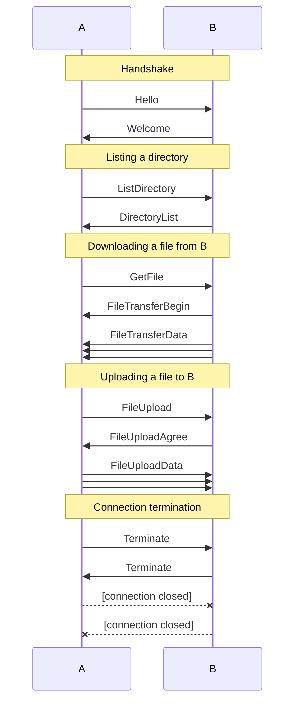

# wftp

A worse file transfer protocol.

## Build

```sh
go build ./cmd/wftp
```

## Usage

wftp assumes one peer is trying to talk to another peer. At least one of the
peers must be listening for a connection. The other peer must connect to the
listening peer.

To listen for a connection, run:

```sh
wftp -l :8080 # no authentication
wftp -l :8080 -s supersecret # with authentication
```

This will drop you into a shell. To connect to a listening peer, run:

```sh
connect 1.2.3.4:8080
```

The peer may require authentication. If so, add the password as the second
argument:

```sh
connect 1.2.3.4:8080 supersecret
```

The user may also choose to give each connection a nickname to refer to:

```sh
alias 1.2.3.4:8080 myserver
```

Otherwise, it is whatever the other peer wishes to call itself:

```
> connect 1.2.3.4:8080
Connected to 1.2.3.4:8080 successfully.
The server identifies itself as "myserver".
```

It is possible to connect to multiple peers at once. To do so, simply run
`connect` again. The user must choose the connection to send commands to by
running `use`:

```sh
use 1.2.3.4:8080
use myserver # also works
```

By default, the latest connection is used.

Once connected, the user may run the following commands:

```sh
# List files in the current directory
ls myserver
# Change directory
cd path/to/dir
# Download a file
get path/to/file
# Upload a file
put path/to/file
# List all active connections
connections
```

It is also possible to pipe commands into wftp:

```sh
cat<<EOF | wftp
connect 1.2.3.4:8080
get Pictures/birthday.jpg
put Documents/important.pdf
EOF
```

> **Note:** wftp does not support TLS. It is recommended to use a VPN or SSH.
> A recommendation is to use [Tailscale](https://tailscale.com/).

> **Note:** when hosted on a server, the user can use `-d`, which will cause
> wftp to drop into headless mode, disabling the interactive shell.

## Protocol Specification

For exact details on how the protocol is encoded, see package `./wftp/message`.
Below is a sequence diagram of how these messages are used:


